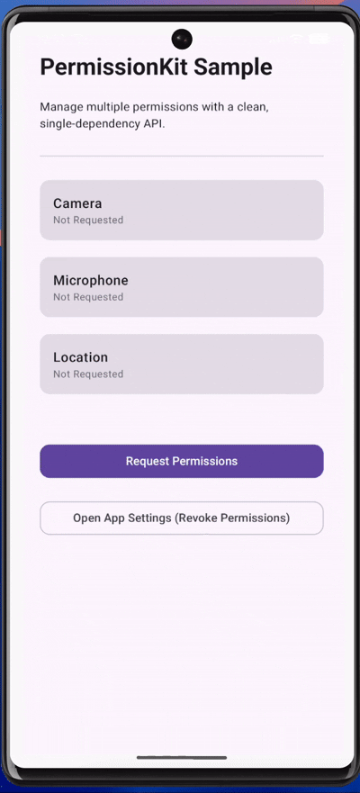
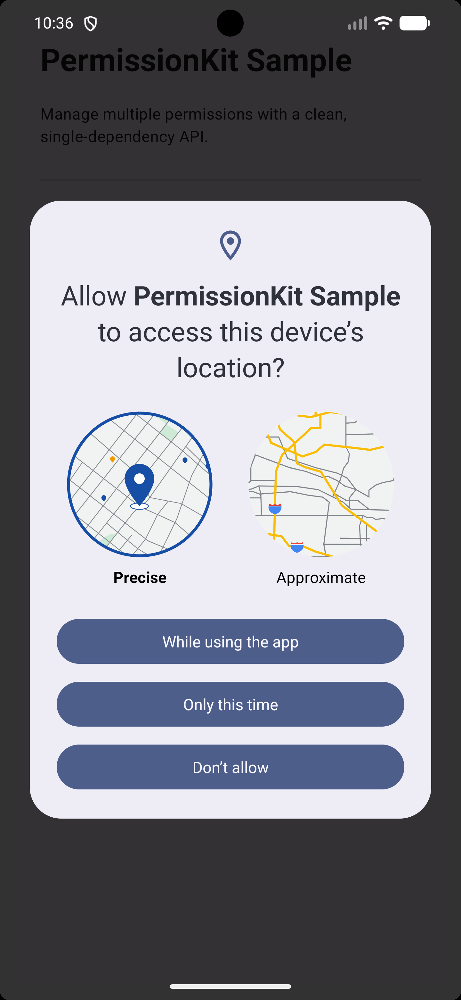

<p align="center">
  
</p>

<h1 align="center">PermissionKit</h1>

<p align="center">
  A modern, single-dependency Android runtime permission SDK<br/>
  for <b>Activity</b>, <b>Fragment</b>, and <b>Jetpack Compose</b>.
</p>

<p align="center">
  <a href="https://search.maven.org/artifact/com.champ96k/permissionkit"></a>
  <a href="https://android-arsenal.com/api?level=21"></a>
  <a href="https://opensource.org/licenses/Apache-2.0"></a>
</p>

<p align="center">
  
  &nbsp;&nbsp;&nbsp;&nbsp;
  
</p>

---

## ✨ Why PermissionKit?

PermissionKit is a **lightweight, production-ready Android SDK** that removes
boilerplate from runtime permission handling while staying **API-21 safe** and
future-proof.

- ✅ Single dependency
- ✅ Activity support
- ✅ Fragment support
- ✅ Jetpack Compose support
- ✅ Works with **all permissions**
- ✅ Rationale & settings redirect built-in
- ✅ No deprecated APIs

---

## 📦 Installation

Add **one dependency only**:

```gradle
dependencies {
    implementation("com.champ96k:permissionkit:1.0.0")
}
````

---

## 🚀 Usage

### 🟦 Activity

```kotlin
PermissionKit.from(this)
    .request(
        Manifest.permission.CAMERA,
        Manifest.permission.RECORD_AUDIO
    )
    .onRationale { permissions, proceed ->
        showRationaleDialog(permissions, proceed)
    }
    .onDenied { result ->
        result.openAppSettings(this)
    }
    .execute { result ->
        if (result.allGranted) {
            openCamera()
        }
    }
```

---

### 🟩 Fragment

```kotlin
PermissionKit.from(this)
    .request(Manifest.permission.ACCESS_FINE_LOCATION)
    .execute { result ->
        if (result.allGranted) {
            fetchLocation()
        }
    }
```

---

### 🟨 Jetpack Compose

```kotlin
val requestPermission = PermissionKit.rememberRequester(
    permissions = arrayOf(
        Manifest.permission.CAMERA,
        Manifest.permission.RECORD_AUDIO
    ),
    onRationale = { permissions, proceed ->
        showRationaleDialog(permissions, proceed)
    },
    onDenied = { result ->
        result.openAppSettings(context)
    }
) { result ->
    if (result.allGranted) {
        openCamera()
    }
}

Button(onClick = requestPermission) {
    Text("Request Permission")
}
```

---

## 📊 PermissionResult

```kotlin
data class PermissionResult(
    val granted: List<String>,
    val denied: List<String>,
    val permanentlyDenied: List<String>
)
```

### Helpers

```kotlin
result.allGranted
result.openAppSettings(context)
```

---

## 🧠 How It Works

```
PermissionKit (Public API)
        ↓
Activity / Fragment / Compose Requesters
        ↓
Android System Permission Dialog
        ↓
PermissionController (Core Logic)
        ↓
PermissionResult
```

---

## 🛠 Requirements

* Min SDK: **21**
* Compile SDK: **36**
* Kotlin
* AndroidX

---

## 🧪 Sample App

A full working example is available in:

```
sample-app/
```

---

## 📄 License

```
MIT License

Copyright (c) 2026 Champ96k
```

---

## 👨‍💻 Author

Built with ❤️ by **Tushar Nikam**

---

## ⭐ Support

If PermissionKit helped you:

* ⭐ Star the repository
* 🐛 Report issues
* 🔧 Open pull requests
